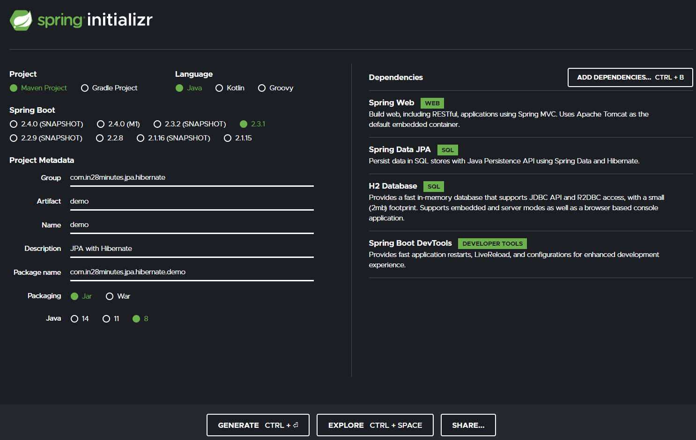
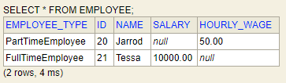
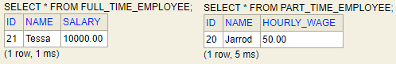
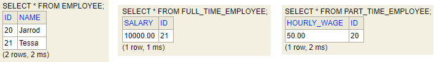
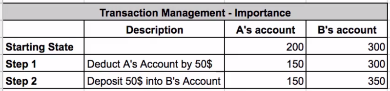
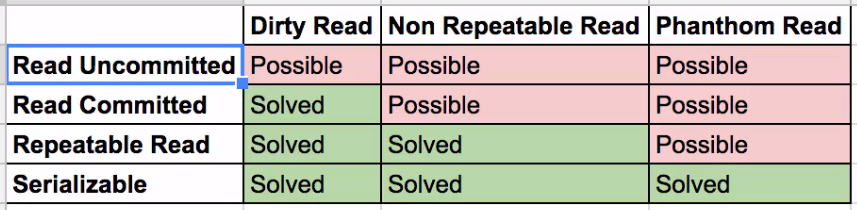
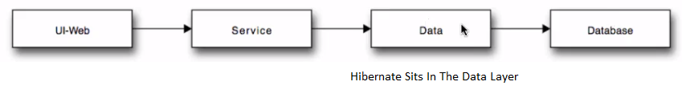
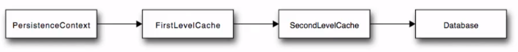
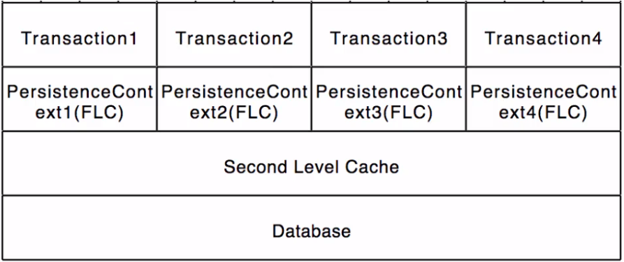

# JPA and Hibernate in Depth

### Section 5: JPA and Hibernate in Depth

All code can be found here: https://github.com/in28minutes/jpa-with-hibernate/tree/master/02-jpa-advanced



## H2 In-Memory Database

Refer to the `spring-jdbc-to-jpa` project's section on H2

## JPA/Hibernate statistics

Add the following to `application.properties`:
```
spring.jpa.properties.hibernate.generate_statistics=true
logging.level.org.hibernate.stat=debug
```
It will display stats like this:
```
Session Metrics {
    15600 nanoseconds spent acquiring 1 JDBC connections;
    0 nanoseconds spent releasing 0 JDBC connections;
    416700 nanoseconds spent preparing 1 JDBC statements;
    659500 nanoseconds spent executing 1 JDBC statements;
    0 nanoseconds spent executing 0 JDBC batches;
    0 nanoseconds spent performing 0 L2C puts;
    0 nanoseconds spent performing 0 L2C hits;
    0 nanoseconds spent performing 0 L2C misses;
    160300 nanoseconds spent executing 1 flushes (flushing a total of 1 entities and 0 collections);
    0 nanoseconds spent executing 0 partial-flushes (flushing a total of 0 entities and 0 collections)
}
```

## SQL Statements in the Console

Add the following to `application.properties`:
```
spring.jpa.show-sql=true
spring.jpa.properties.hibernate.format_sql=true
logging.level.org.hibernate.type=trace
```

It will display the SQL statements like this:
```
Hibernate: 
    select
        course0_.id as id1_0_0_,
        course0_.name as name2_0_0_ 
    from
        course course0_ 
    where
        course0_.id=?
o.h.type.descriptor.sql.BasicBinder      : binding parameter [1] as [BIGINT] - **[1]**
o.h.type.descriptor.sql.BasicExtractor   : extracted value ([name2_0_0_] : [VARCHAR]) - **[Science]**
```

## Reasons For Using Native Queries

If you need to do a mass update

## Entity Inheritance

### SINGLE TABLE
> **Choose this one for performance**
1. Default inheritance if none is provided
2. Creates a column called DTYPE (Discriminator Type). Name can be changed.

**Pros:** Fast, no joins<br>
**Cons:** Bad data integrity due to nullable fields (which shouldn't be) 

```
@Entity
@Inheritance(strategy = InheritanceType.SINGLE_TABLE)
@DiscriminatorColumn(name = "EmployeeType")
public abstract class Employee {
...
```



### TABLE PER CLASS
> **Don't worry about using this one**
1. Creates a table per concrete entity class
2. A union is done to retrieve all rows from all tables, which is not such a big performance hit.

**Pros:** Fast & Good data integrity<br>
**Cons:** Common columns are repeated in both tables.

    select
        employee0_.id as id1_1_,
        employee0_.name as name2_1_,
        employee0_.salary as salary1_2_,
        employee0_.hourly_wage as hourly_w1_3_,
        employee0_.clazz_ as clazz_ 
    from
        ( select
            id,
            name,
            salary,
            null as hourly_wage,
            1 as clazz_ 
        from
            full_time_employee 
        union
        all select
            id,
            name,
            null as salary,
            hourly_wage,
            2 as clazz_ 
        from
            part_time_employee 
    ) employee0_

```
@Entity
@Inheritance(strategy = InheritanceType.TABLE_PER_CLASS)
public abstract class Employee {
...
```



### JOINED
> **Choose this one for data integrity**
1. Creates a table for the super class, as well as separate tables for all sub classes

**Pros:** No duplication, good data integrity<br>
**Cons:** Slight performance hit due to joins across tables

    select
        employee0_.id as id1_1_,
        employee0_.name as name2_1_,
        employee0_1_.salary as salary1_2_,
        employee0_2_.hourly_wage as hourly_w1_3_,
        case 
            when employee0_1_.id is not null then 1 
            when employee0_2_.id is not null then 2 
            when employee0_.id is not null then 0 
        end as clazz_ 
    from
        employee employee0_ 
    left outer join
        full_time_employee employee0_1_ 
            on employee0_.id=employee0_1_.id 
    left outer join
        part_time_employee employee0_2_ 
            on employee0_.id=employee0_2_.id
           
```
@Entity
@Inheritance(strategy = InheritanceType.JOINED)
public abstract class Employee {
...
```


### Mapped Super Class
> **This one is just rubbish**
1. This annotation sits on the parent class
2. The parent class does not have a table representing it, therefore it can't have @Entity annotation
3. The parent class is only used to hold common properties
4. Separate tables are created for each subclass - like TABLE_PER_CLASS
5. You can't query on the parent class. You have to query on the individual sub classes

**Pros:** Fast & Good data integrity<br>
**Cons:** Common columns are repeated in both tables.<br>
          You have to do the join yourself.

I don't see any advantages of this over TABLE_PER_CLASS, because with TABLE_PER_CLASS you can query on the parent class to get data for both sub classes through a union, or you can query the sub classes separately.

```
@MappedSuperclass
public abstract class Employee {
...
```


## Transaction Management

### ACID

#### A - Atomicity
A single transaction is possibly made up of many different interactions with the DB.
Their individual interactions are an indivisible part of a whole transaction.
eg. If all changes to a DB, within a transaction, are successful then it can be committed, otherwise all those changes need to be rolled back 

#### C - Consistency
Any transaction should leave the DB in a consistent state.
IOW If a step in a transaction fails, it must rolled back, otherwise the DB will be in an inconsistent state

Take the example below:


In order to achieve consistency the total amount of money across the 2 bank accounts must be the same after the transaction has failed or succeeded.

#### I - Isolation
How does 1 transaction affect another transaction which is running in parallel.
IOW Can the 2nd transaction read the uncommitted values of the 1st transaction?

> `@Transactional(isolation=<Isolation Level>)`

```
# Default Transaction Isolation Level - java.sql.Connection contains what the values mean
# None = 0
# Read Uncommited = 1
# Read Committed = 2
# Repeatable Read = 4
# Serializable = 8
spring.jpa.properties.hibernate.connection.isolation = 2
```

##### Isolation Problems
1. **Dirty Read**: Reading a record of another transaction that hasn't completed yet.
2. **Non Repeatable Read**: Getting back different values for the same select statement at different times in the same transaction. IOW Someone else changed the record.
3. **Phantom Read**: Getting back a different set of records for the same select statement at different times in the same transaction. IOW Someone else inserted/removed a record.

##### Levels of Isolation
1. **Uncommitted Read**: Any transaction can read any update row before it is committed. This isn't solving any of the above problems.
2. **Committed Read**: Outside transactions can only read the updated value after the transaction has completed. This solves `Dirty Read`. Locks the modified value being changed from even being read.
3. **Repeatable Read**: This locks the rows being read by a transaction. This solves `Dirty Read` & `Non Repeatable Read`. IOW If you do a `select * from employee where id = 10` then the entire row that is selected won't be available to other transactions. 
4. **Serializable**: This locks the entire row that matches the select statement's constraint until the transaction commits. IOW If you do a `select *` then the entire table is locked. You will not be able to insert into the table that matches the select statement's criteria.



#### D - Durability
Once a transaction is successful it must persisted even if there are other system failures.
eg. The withdrawal & deposit transaction is successful, but the SMS to the client fails.

### @Transactional
**JPA Transaction Management:** Can handle a transaction to 1 DB.<br>
`javax.transaction.Transactional`<br><br>
**Spring Transaction Management:** Can handle a transaction across multiple DBs & Queues.<br>
`org.springframework.transaction.Transactional`<br>


## Caching



### Caching Levels


### Caching Example


### First Level Cache
FLC is within the boundary of a single transaction.
It is set up/configured by default.
eg. If a transaction retrieves the same entity instance multiple times within its lifetime, then it will retrieve it from the DB only once, store it in FLC (Persistence Context), and from then on retrieve it from the cache.

### Second Level Cache
SLC comes into the picture across multiple transactions.
SLC survives browser refreshes.
This has to be set up explicitly, like including EhCache in the pom.xml.
```
<dependency>
    <groupId>org.hibernate</groupId>
    <artifactId>hibernate-ehcache</artifactId>
</dependency>
```
This stores data that won't change across different users, like countries, states, etc...

Update `application.properties`:
```
# Second Level Cache - EhCache
# Enable SLC
spring.jpa.properties.hibernate.cache.use_second_level_cache=true
# Specify what caching framework to use - EhCache
spring.jpa.properties.hibernate.cache.region.factory_class=org.hibernate.cache.ehcache.internal.EhcacheRegionFactory
# Cache Mode: Only cache what I say (see javax.persistence.SharedCacheMode for different modes)
spring.jpa.properties.javax.persistence.sharedCache.mode=ENABLE_SELECTIVE
# Set logging level to debug for EhCache package
logging.level.net.sf.ehcache=debug
```

In order to specify what entities must be cached, we must add `@Cacheable` to the entity.

```
@Entity
@Cacheable
public class Course {
...
```
