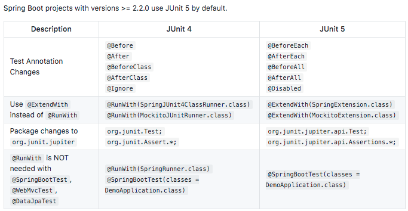

# JUnit In 5 Steps

### Section 4: Introduction to JUnit in 5 Steps

All code can be found here: https://github.com/in28minutes/jpa-with-hibernate/tree/master/00-framework-tool-introductions/03.JUnit-Introduction-In-5-Steps

### Create A New Java Package

### Create A New JUnit Test Case

### Add New Test Folder To Build Path

> After doing all this you might need to close the project & reopen it, to remove any package name errors

### Run JUnit Tests

## Differences between JUnit 4 & JUnit 5

### JUnit 5 Guide:
https://github.com/in28minutes/in28minutes-initiatives/blob/master/The-in28Minutes-TroubleshootingGuide-And-FAQ/junit5.md

### JUnit 5 Upgrade Commit
https://github.com/in28minutes/jpa-with-hibernate/commit/0ae2007c8e08420e6d5ab2a86499274c7c60c8ae

