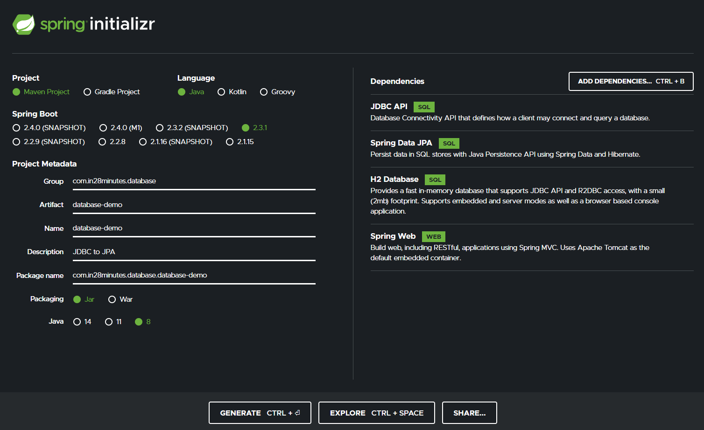
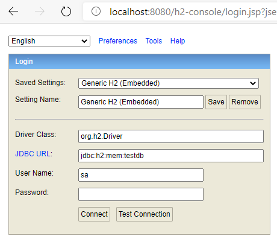

# Spring JDBC to JPA

### Section 3: Journey From Spring JDBC to JPA

All code can be found here: https://github.com/in28minutes/jpa-with-hibernate/tree/master/01-from-jdbc-to-jpa



## H2 In-Memory Database

### Enable H2 Console

1. Add to `application.properties`
```
spring.h2.console.enabled=true
```

2. Spring Boot >= version 2.3.0 randomly generates the H2 database name

You should see this in the console when you run or debug
```
H2 console available at '/h2-console'. Database available at 'jdbc:h2:mem:54ceac32-c219-4903-b171-db24d32f6fa5'
```
To prevent this, add to `application.properties`
```
spring.datasource.url=jdbc:h2:mem:testdb
```
You should now see this in the logs
```
H2 console available at '/h2-console'. Database available at 'jdbc:h2:mem:testdb'
```

3. Spring Boot >= version 2.1

BootstrapMode for JPA Repositories is now "deferred" to improve startup time. 

Add to `application.properties`
```
spring.data.jpa.repositories.bootstrap-mode=default
```

4. Navigate to H2-Console
http://localhost:8080/h2-console


### POM.xml

This entry causes Spring Boot to auto configure a datasource that connects to an H2 In-Memory DB.
```
<dependency>
  <groupId>com.h2database</groupId>
  <artifactId>h2</artifactId>
  <scope>runtime</scope>
</dependency>
```

### Creating Tables & Populating Data

Create a `data.sql` file in `src/main/resources` with the SQL.
It has to be called `data.sql`.

### H2 Console Troubleshooting

https://github.com/in28minutes/in28minutes-initiatives/blob/master/The-in28Minutes-TroubleshootingGuide-And-FAQ/jpa-and-hibernate.md
