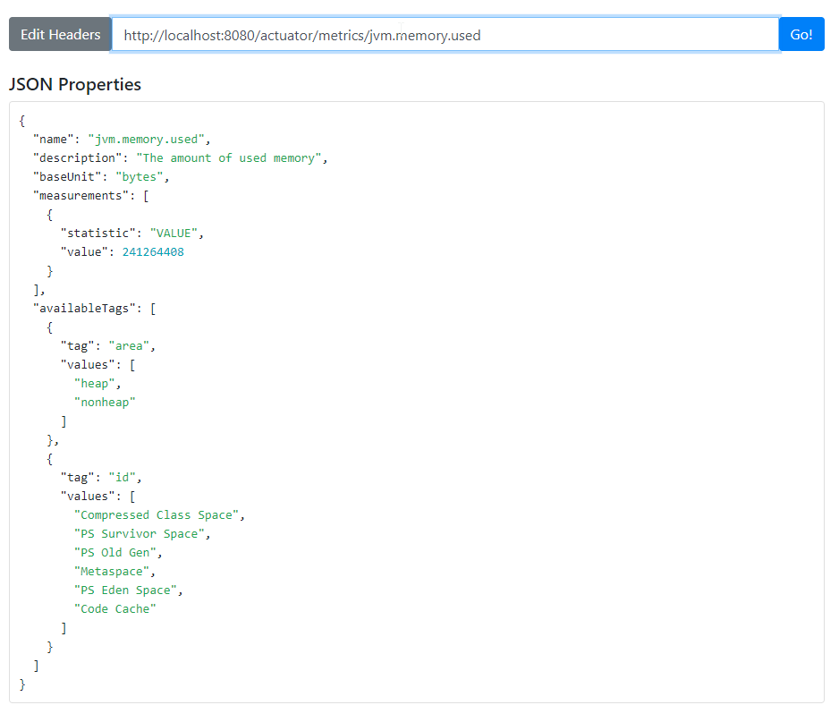

# Spring Boot in 10 Steps

### Section 2: Introduction to Spring Boot in 10 Steps

All code can be found here: https://github.com/in28minutes/jpa-with-hibernate/tree/master/00-framework-tool-introductions/02.Spring-Boot-Introduction-In-10-Steps

### Troubleshooting Guide
https://github.com/in28minutes/in28minutes-initiatives/blob/master/The-in28Minutes-TroubleshootingGuide-And-FAQ/quick-start.md

### Auto Configuration

Spring Boot looks at a) Frameworks available on the CLASSPATH b) Existing configuration for the application. Based on these, Spring Boot provides basic configuration needed to configure the application with these frameworks. This is called Auto Configuration.

https://www.springboottutorial.com/spring-boot-auto-configuration

### Actuator

> <dependency>
>	<groupId>org.springframework.boot</groupId>
>	<artifactId>spring-boot-starter-actuator</artifactId>
> </dependency>

Actuator provides monitoring.
-- How many times a specific service was called/failed

Actuator URL
http://localhost:8080/actuator

Actuator exposes a lot of REST services.
These services are compliant with the HAL standard.
We can use a HAL browser to browser through the data provided by the actuator.

> **HAL Browser is deprecated**
> <dependency>
>	<groupId>org.springframework.data</groupId>
>	<artifactId>spring-data-rest-hal-browser</artifactId>
> </dependency>

> **Use HAL Explorer instead**
> <dependency>
>	<groupId>org.springframework.data</groupId>
>	<artifactId>spring-data-rest-hal-explorer</artifactId>
> </dependency>

HAL Browser/Explorer URL
http://localhost:8080

> application.properties
> 		management.endpoints.web.exposure.include=* <-- Actuator monitors all endpoints

#### Example of HAL Explorer viewing metrics

### Application.properties

To get auto complete: Install **Spring Tools Eclipse Plugin**

### Spring Boot Developer Tools

Picks up code changes without restarting the server

> <dependency>
>	<groupId>org.springframework.boot</groupId>
>	<artifactId>spring-boot-devtools</artifactId>
> </dependency>
